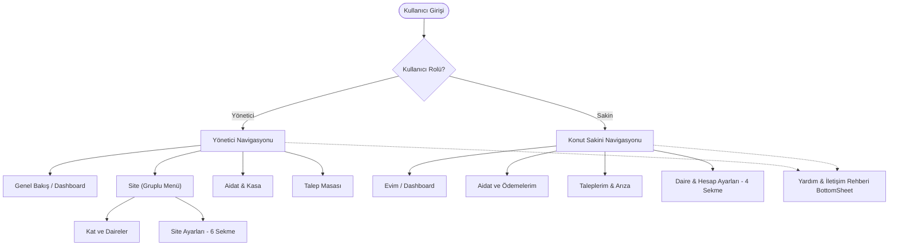

# Kovan Mobil UI/UX Spesifikasyonu & Yapay Zeka Geliştirici Kılavuzu

> Bu belge; Kovan Apartman & Site Yönetim Platformu web sürümünde geliştirilen tüm ekranların, iş kurallarının ve tasarım sisteminin (Design System) mobil platforma (React Native, Flutter veya Mobile Web) birebir aktarılması için hazırlanmış **tam kapsamlı teknik ve görsel şartnamedir**.
> Ekip arkadaşınız bu dokümanı doğrudan kendi yapay zekasına (AI modeline) sistem promptu veya görev tanımı olarak verebilir.

---

## 🤖 Ekip Arkadaşının Yapay Zekası İçin Doğrudan Kopyalanabilir Prompt

Aşağıdaki blok, mobil projede çalışan AI asistanına (ChatGPT, Claude, Gemini, Cursor vb.) doğrudan verilebilecek **ana sistem talimatıdır**:

```markdown
Sen Kovan PropTech mobil uygulamasını geliştiren kıdemli bir Mobil UI/UX Mühendisisin.
Web platformundaki kurumsal kimliği, altın-bronz vurgulu zarif renk paletini ve ekran mimarisini mobil ortama piksel hassasiyetinde aktaracaksın.

Aşağıdaki teknik ve görsel kurallara sadık kalarak tüm ekranları mobil platform için (React Native / Flutter / Responsive) oluştur:
1. Rol Tabanlı Erişim: "Site Yöneticisi" ve "Konut Sakini" ayrımını koru.
2. Tasarım Dili: Beyaz/koyu gri zemin üzerine zarif #cda65b (Gold) vurguları, 8px/12px border-radius, modern kart yapıları, Lucide ikon ailesi.
3. Yönetici Site Ayarları: 6 sekmeden oluşan kurumsal merkez (Genel, Finans, Aidat Politikası, Tesis & Akıllı Geçiş, Bildirim & SMS, Güvenlik & KVKK).
4. Sakin Hesap Ayarları: 4 sekmeden oluşan mobil dostu sakin merkezi (Profil & Daire Bilgisi, Araçlarım & Plaka, Bildirim Tercihleri, Güvenlik & İzinler).
5. Yardım & İletişim: Yönetim, Güvenlik ve Teknik Masayı içeren 3 operasyonel kart ve SSS alanı (Bottom Sheet modal).
6. Tarih Standardı: Türkçe yerelleştirilmiş, tam ay adlarına sahip (gün, ay, yıl, gün adı) dinamik tarihleme.

Şimdi sağlanan tasarım token'larını, bileşen anatomilerini ve ekran akışlarını kullanarak mobil ekranları inşa et.
```

---

## 1. Tasarım Sistemi & Token'lar (Design Tokens)

### 1.1 Renk Paleti (Color Palette)

| Değişken Adı | Açık Tema (Light Mode) | Koyu Tema (Dark Mode) | Kullanım Alanı |
|---|---|---|---|
| `--gold` | `#cda65b` | `#dfbe7a` | Ana marka rengi, aktif sekme çizgileri, butonlar |
| `--gold-dark` | `#9d7c3e` | `#cda65b` | Vurgulu metinler, etiketler, ikonlar |
| `--gold-light` | `#fbf7ee` | `#252119` | İkon arka planları, hafif vurgulu alanlar |
| `--gold-border` | `#e5dec9` | `#554420` | Vurgulu kart kenarlıkları |
| `--surface` | `#ffffff` | `#18181b` | Kartlar, form elemanları, modal arka planları |
| `--page` | `#f8f8fa` | `#111113` | Ekran genel arka planı |
| `--line` | `#e4e4e7` | `#27272a` | Ayırıcı çizgiler, pasif border'lar |
| `--ink` | `#18181b` | `#f4f4f5` | Ana başlık ve gövde metinleri |
| `--muted` | `#71717a` | `#a1a1aa` | İkincil metinler, açıklamalar, ipuçları |
| `--success` | `#10b981` | `#34d399` | Başarılı durumlar, "Ödendi", "7/24 Aktif" |
| `--warning` | `#f59e0b` | `#fbbf24` | Bekleyen onaylar, incelemedeki talepler |
| `--danger` | `#ef4444` | `#f87171` | Gecikmiş borçlar, silme butonları |

### 1.2 Tipografi & Metin Ölçeği
- **Font Ailesi:** `Inter`, `SF Pro Display` (iOS), `Roboto` (Android), `system-ui`.
- **Ekran Başlığı (H1):** `22px` - `24px`, SemiBold (600), Harf aralığı: `-0.5px`.
- **Bölüm Başlığı (H2/H3):** `15px` - `17px`, SemiBold (600).
- **Kart Başlığı (H4):** `13px` - `14px`, SemiBold (600).
- **Gövde Metni (Body):** `13px` - `14px`, Regular (400), Satır yüksekliği: `1.5`.
- **Açıklama / Muted:** `11px` - `12px`, Regular (400).
- **Mikro Etiket (Badge/Eyebrow):** `10px`, Medium (500) veya SemiBold (600), Uppercase.

### 1.3 Yuvarlaklık (Border Radius) & Gölgeler
- **Rozetler & Pill:** `20px` (tam yuvarlak)
- **Kartlar & Konteynerlar:** `10px` - `12px`
- **Girdi Alanları (Input / Select):** `8px`
- **Butonlar:** `8px` - `10px`
- **Gölge (Shadow):** `0 1px 3px rgba(0, 0, 0, 0.05)` (hafif, temiz, flat proptech hissi).

---

## 2. Navigasyon & Rol Mimarisi

Mobil arayüzde iki ayrı deneyim mevcuttur:



### 2.1 Mobil Menü Düzeni (Öneri)
- **Alt Bar (Bottom Navigation):**
  1. 🏠 **Ana Sayfa:** Dashboard (Özet kartları, finans, hızlı aksiyonlar).
  2. 💳 **Ödemeler:** Aidat listesi, borç durumu, kartla ödeme.
  3. 💬 **Talepler:** Arıza/talep oluşturma, durum takibi.
  4. ⚙️ **Ayarlar:** Yönetici için "Site & Daire Yönetimi", Sakin için "Daire & Hesap Ayarları".
- **Başlık / Profil Barı:**
  - Sol: Kovan logosu & Daire/Rol rozeti.
  - Sağ: 🔔 Bildirimler, 🌗 Tema değiştirici (Light/Dark), 📞 Yardım/Rehber butonu.

---

## 3. Yönetici: Site Ayarları (6 Sekmeli Kurumsal Merkez)

Yönetici sekmesinde mobil ekranda yatay kaydırılabilir (horizontal scroll) veya segmented control şeklinde **6 sekme** bulunur:

### Sekme 1: 🏢 Genel & Kurumsal Kimlik
- **Site Resmi Adı:** Metin kutusu (Örn: *Kovan Sitesi*).
- **İl & İlçe:** İki sütunlu seçim (Örn: *İstanbul, Kadıköy*).
- **Açık Adres:** Çok satırlı metin kutusu.
- **Blok & Daire Sayısı:** Sayısal göstergeler (Örn: *3 Blok, 24 Daire*).
- **Yönetici Ad & Soyad / İletişim:** Telefon ve e-posta girdileri.

### Sekme 2: 💳 Finans & Banka Hesapları
- **İki Ayrı Fon Kartı:**
  1. *İşletme Bütçesi Hesabı:* Banka adı, hesap sahibi unvanı, İşletme IBAN (TR... formatında kopyalanabilir).
  2. *Demirbaş & Yatırım Fonu Hesabı:* Kat mülkiyeti kanunu gereği demirbaş ödemelerinin ayrı toplanması için özel IBAN.
- **Sanal POS Entegrasyonu:** Komisyonun kime yansıtılacağı (Sakin / Yönetim) ve taksit seçenekleri anahtarı (toggle).

### Sekme 3: ⚖️ Aidat Politikası & Dağıtım Modelleri
- **Aylık Varsayılan Aidat:** Tutar girişi (₺).
- **Son Ödeme Günü:** Her ayın X. günü (1-28).
- **Gecikme Faizi:** Aylık % faiz oranı (varsayılan: %5).
- **3 Farklı Hesaplama Modeli (Radio Kartlar):**
  1. *Sabit Tutar:* Tüm daireler eşit öder.
  2. *Metrekareye (m²) Göre Dağıtım:* m² başına birim maliyet çarpımı.
  3. *Daire Tipine Göre Dağıtım:* 1+1, 2+1, 3+1 tiplerine göre ayrı aidat skalası.

### Sekme 4: 🚪 Tesis, Donanım & Akıllı Geçiş
- **Plaka Tanıma Sistemi (PTS):** Otopark bariyer entegrasyonu toggle'ı.
- **Mobil / QR Kapı Açma:** Sakinlerin telefonla bina giriş kapısını açabilmesi toggle'ı.
- **Yüz Tanıma / Turnike:** Tesis giriş güvenliği toggle'ı.
- **Misafir Araç Giriş Modeli:** "Güvenlik Onayı Zorunlu" veya "Plakayı Bildiren Direkt Geçer" seçimi.

### Sekme 5: 📲 Bildirim & SMS Otomasyonu
- **Aidat Tahakkuk Bildirimi:** Her ayın 1'inde otomatik SMS/Push gönderimi.
- **Son Gün Hatırlatması:** Son ödemeden 2 gün önce uyarı.
- **Gecikme Uyarısı:** Vade geçtiğinde nazik SMS uyarısı.
- **SMS Başlığı (Sender ID):** Örn: `KOVAN SITE`.

### Sekme 6: 🛡️ Güvenlik & KVKK Politikası
- **Telefon Numarası Gizliliği:** Sakinlerin telefonları diğer komşulara gizlensin (Yalnızca yönetim ve güvenlik görsün).
- **Plaka Rehberi Koruması:** Otoparkta plaka sorgulama sadece güvenlik personeline açık olsun.
- **Borçlu İsim Listesi Yasağı:** Panolara KVKK uyarınca açık isimli borçlu listesi asılamaz kuralı.

---

## 4. Konut Sakini: Daire & Hesap Ayarları (4 Sekme)

Sakin ekranında gereksiz karmaşa ve aile soybağı sorgulamaları kaldırılmış, doğrudan operasyonel 4 sekme kurgulanmıştır:

### Sekme 1: 👤 Profil & Dairem
- **Daire Kartı:** Blok ve Daire No (Salt okunur etiket: Örn. *A Blok · Daire 12*).
- **İletişim Bilgileri:** Ad Soyad, E-posta, Telefon Numarası.
- **Dairede Yaşayan Kişi Sayısı:** Sayısal seçim kutusu (1 ile 8 arası).
  > **Tasarım Notu:** Bireylerin T.C. kimlik veya detaylı aile kütük bilgileri tutulmaz; asansör, su ve ortak gider hesapları için yalnızca yaşayan kişi sayısı yeterlidir.
- **Evcil Hayvan Kaydı:** Standart simetrik seçim menüsü (Dropdown):
  - `Yok`
  - `Var (Kedi)`
  - `Var (Köpek)`
  - `Var (Diğer)`
- **Sahiplik Türü:** `Kat Maliki (Ev Sahibi)` veya `Kiracı`.

### Sekme 2: 🚗 Araçlarım & Otopark
- **Kayıtlı Araç Listesi:**
  - Plaka rozeti (Örn. `34 ABC 789` - monospaced / tabular yazı tipi).
  - Araç etiketi (Örn: *1. Araç (Beyaz Megane)*).
  - Silme butonu (Çöp kutusu ikonu).
- **Yeni Araç Ekle Butonu / Modal:**
  - Plaka girdisi (Büyük harfe otomatik zorlayan input).
  - Araç model/renk kısa notu.
  - "PTS'ye (Plaka Tanıma) Kaydet" butonu.

### Sekme 3: 🔔 Bildirim Tercihleri
- **Kanal Seçimleri (Switch / Toggle):**
  - Push Bildirimleri (Mobil anlık bildirimler).
  - SMS Bildirimleri (Acil ve ödeme mesajları).
  - E-posta Özeti (Aylık bülten ve makbuzlar).
- **Konu Tercihleri:**
  - Aidat & Finans Hatırlatıcıları.
  - Talep & Arıza Durum Güncellemeleri.
  - Yönetim Duyuruları & Toplantılar.

### Sekme 4: 🔒 Güvenlik & İzinler
- **Şifre Değiştirme:** Mevcut şifre, yeni şifre onay alanları.
- **Ziyaretçi Kabul Onayı:** Güvenlik nizamiyesinden gelen misafir araçlar için cepten anlık onay bildirimi alma tercihi.
- **İletişim Gizliliği:** Komşuluk listesinde numaramın gizlenmesini istiyorum anahtarı.

---

## 5. Yardım & İletişim Rehberi (Destek Modalı / BottomSheet)

Mobilde alttan açılan bir **Bottom Sheet** (veya tam ekran dialog) olarak tasarlanır:

### 5.1 Üç Ana İrtibat Kartı

```
┌────────────────────────────────────────────────────────┐
│ [🏢] Yönetim Ofisi                                     │
│      A Blok · Zemin Kat                                │
│      🕒 Hafta İçi: 09:00 – 18:00                        │
│      📞 Dahili: 100 (0532 555 99 00)                   │
│      ✉️ yonetim@kovan.app                              │
├────────────────────────────────────────────────────────┤
│ [🛡️] Güvenlik & Danışma             [7/24 Kesintisiz]   │
│      Ana Giriş Nizamiyesi                              │
│      📞 Dahili: 101 (0532 555 99 01)                   │
│      🕒 Misafir Araç & Kargo Kabulü                    │
├────────────────────────────────────────────────────────┤
│ [🔧] Teknik Servis & Arıza Masası       [Dahili: 102]  │
│      Ortak alan elektrik, hidrofor, asansör ve tesisat │
│      arızalarını anında bildirin.                      │
│                                                        │
│      [ Talepleri Gör ]    [ + Arıza Bildir ]           │
└────────────────────────────────────────────────────────┘
```

### 5.2 Hızlı İpuçları & SSS Kutusu (FAQ Box)
- **Kesik Çizgili (Dashed Border) Vurgu Kutusu:**
  - 💳 **Aidat Ödemeleri:** *"Ödemeler sekmesinden kredi kartı veya havale ile anında ödenebilir."*
  - 🚗 **Otopark & Bariyer:** *"Plakanızı Ayarlar > Araçlarım sekmesine kaydederek bariyerden otomatik geçebilirsiniz."*
  - 👥 **Misafirler:** *"Güvenlik nizamiyesine önceden haber vererek misafir otoparkına yönlendirebilirsiniz."*

---

## 6. Tarih & Yerelleştirme Standartları

Web sürümünde giderilen tüm tarih bug'ları mobil kod tabanında ilk günden standartlaştırılmalıdır:

1. **Header Tarih Rozeti (Date Chip):**
   - Format: `gün ay(uzun) yıl, gün_adı`
   - Örnek Çıktı: **26 Eylül 2026, Cumartesi**
   - Kod Karşılığı:
     ```javascript
     const today = new Date();
     const formattedDate = today.toLocaleDateString("tr-TR", {
       day: "numeric",
       month: "long",
       year: "numeric",
     }) + ", " + today.toLocaleDateString("tr-TR", { weekday: "long" });
     ```
   - Görünüm: Altın rengi `CalendarDays` ikonu, tek satırda taşma yapmayan (`white-space: nowrap`), dikey ortalanmış zarif çip.
2. **Tablo ve Kart Tarihleri (`dateLabel`):**
   - Kısa/kesik ay adları (`Eyl`) yerine daima tam Türkçe ay adı (`Eylül`) kullanılmalıdır.
   - Hata koruması: `null`, `undefined` veya geçersiz tarih girildiğinde `Invalid Date` yerine `"—"` dönmelidir.

---

## 7. Mobil Geliştirici İçin Kontrol Listesi (Checklist)

- [ ] **Dark Mode Desteği:** Tüm `--surface`, `--page`, `--ink` renkleri koyu temada otomatik geçiş yapmalı.
- [ ] **Dokunma Alanı (Touch Target):** Tüm butonlar, switch'ler ve sekme başlıkları minimum `44x44 pt` olmalı.
- [ ] **Klavye Yönetimi:** Form doldururken `KeyboardAvoidingView` kullanılmalı; butonlar klavye altında kalmamalı.
- [ ] **Tab Bar Scroll:** Site Ayarları 6 sekmesi dar ekranlarda yatayda rahatça kaydırılabilmeli (`showsHorizontalScrollIndicator={false}`).
- [ ] **Plaka Formatlaması:** Araç plakası eklerken klavye `characters` modunda büyük harf açmalı.
- [ ] **Hızlı Arama:** Telefon numaralarına tıklandığında `tel:0532...` protokolü ile doğrudan arama başlatılmalı.
